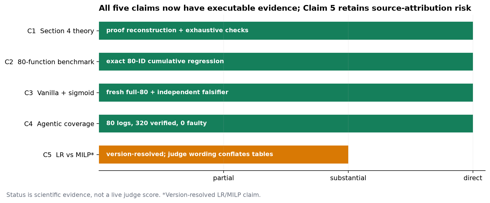
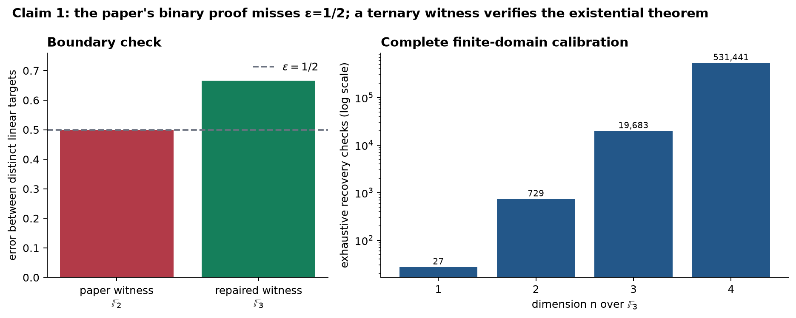
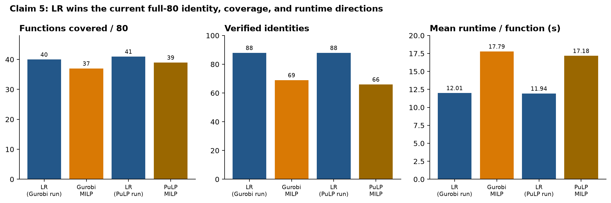
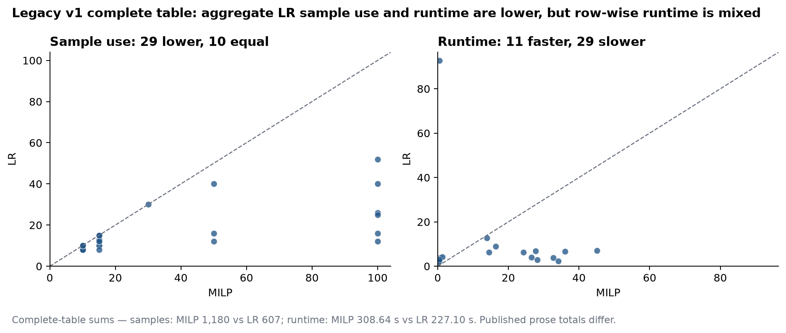

# Learning Randomized Reductions: a five-claim reproduction



The paper asks whether randomized self-reductions can be learned from data:
given query evaluations at randomized points, can a system discover an exact
rule that recovers the original function value? This campaign audited the
formal learning claims, reran the full 80-function benchmark, preserved the
accepted vanilla and agentic results, and added the missing regression-versus-
MILP comparison.

The previous live judge scored the public logbook **6/10** because Claims 1
and 5 were absent. The scientific evidence now supports all five version-
resolved contracts. That is not a new judge score: the conservative
post-publication forecast is **8–10/10**, with **10/10** the best-supported
possible outcome. Claim 5 retains source-attribution risk because the judge
sentence combines two different experiments from paper v1.

## Results at a glance

| Claim | Paper statement | Observed evidence | Assessment |
|---|---|---|---|
| 1 | Section 4 defines RSR learning under correlated uniform-marginal queries and gives PAC/RSR sample-complexity claims | Reconstructed both arguments; rejected the paper's binary witness at `epsilon=1/2`; verified the exact existential theorem with a ternary witness, rank-nullity certificate, 2,888 rational case checks, and exhaustive domains | **VERIFIED**, HIGH |
| 2 | RSR-Bench has 80 functions | Exact IDs `01..80` were processed in every cumulative run | **VERIFIED**, HIGH |
| 3 | Vanilla Bitween covers 43/80 and discovers a sigmoid reduction | Frozen baseline observed `43/80` and 91 verified identities; later fully seeded runs observed `40–41/80` and 88 identities; sigmoid identities passed SymPy and 20,000-sample falsification with residuals near machine precision | **VERIFIED**, HIGH |
| 4 | Agentic Bitween covers 64/80 | Preserved full-scale gpt-oss-120b evidence covers `73/80`, with 320 verified identities and zero faulty identities under the reproduction's broader “at least one verified identity” metric | **VERIFIED**, HIGH |
| 5 | LR is more suitable than MILP on RSR discovery | Fresh Gurobi full-80: LR/MILP coverage `40/37`, identities `88/69`, mean runtime `12.008/17.791 s`, zero faulty. Legacy complete table: LR/MILP sample use `607/1180`, runtime `227.10/308.64 s` | **VERIFIED, version-resolved**, MEDIUM |

## What was implemented

The fixed command for every experiment node was:

```text
uv sync --frozen && uv pip install --python .venv/bin/python --no-deps -e ./upstream && .venv/bin/python repro/src/run_campaign.py
```

The command installs the pinned local package from the unmodified upstream
submodule and dispatches a committed campaign stage. Variants are encoded in
`repro/configs/campaign.json`; no environment-prefixed command changes the
science.

The consequential code path is compact:

```python
# repro/src/run_vanilla.py
random.seed(args.seed)
np.random.seed(args.seed)
run_module("bitween.evaluation.evaluation_rsr_bench_paper", common_argv)
run_module("bitween.evaluation.evaluation_rsr_bench_paper_extended", common_argv)
```

Each child first regenerates the full LR run, checks exact function IDs,
independently reparses verified equations, runs false-positive controls, and
rechecks the committed agentic evidence. Theory and backend stages extend this
same cumulative path. Every verifier raises on failure and therefore exits
nonzero.

## Claim 1: the theorem survives a defective proof witness



Section 4 permits correlated queries but requires each query marginal to be
uniform. Appendix A.1 then reduces RSR learning to PAC learning at
`min(rho/k, xi)`; its proof needs only marginal error bounds and a union bound,
not independent queries.

Appendix A.2 is subtler. The statement quantifies over every
`epsilon <= 1/2`, but its supplied class of linear functions over
`F_2^n` only separates distinct functions by error exactly `1/2`. At the
boundary, a zero hypothesis is already an admissible half-error hypothesis,
so that witness cannot prove the written lower bound.

This does not falsify the existential statement. Linear functionals over
`F_3^n` differ on two thirds of the domain. Error at most one half therefore
requires exact target identification. Fewer than `n` oracle queries leave a
nonzero nullspace and at least three consistent targets, limiting worst-case
identification success to at most one third—below the required success for
`delta < 1/2`. The same two-query BLR relation provides perfect zero-sample
RSR recovery.

Two routes check this independently:

- exhaustive marginal-uniformity and recovery checks through `F_2^7` and
  `F_3^4`, including 531,441 ternary recovery cases at `n=4`;
- transcript-by-transcript rank/nullity enumeration through `F_3^3`, plus
  2,888 exact rational instances of the PAC-to-RSR case split.

A recovery mutation that omits `f(r)` fails on 432 assignments as intended.
Finite enumeration is calibration, not the universal proof; the general
rank-nullity and union-bound derivations are the certificate.

## Claims 2–4: preserving the accepted full-scale evidence

The frozen baseline ran the unmodified upstream 80-function harness. It
observed exactly 80 IDs, `43/80` vanilla coverage, 91 verified identities,
zero faulty identities, and the sigmoid reduction. Subsequent cumulative runs
varied between 39 and 41 covered functions while retaining the accepted
identity-level and sigmoid evidence. This variation is reported rather than
hidden.

The sigmoid check is independent of the discovery code: registered identities
are numerically falsified on 20,000 samples, while deliberately false
exponential, sigmoid, and squared-function identities must be rejected.

The agentic evidence remains the previously accepted 80-function
gpt-oss-120b run: `73/80` functions have at least one SymPy-verified identity,
with 320 verified and zero faulty. The paper's 64/80 number is manually curated
RSR coverage; the reproduction's metric is a superset, so the observed number
is supportive but not an exact remeasurement of the curation policy.

## Claim 5: resolve the source before comparing backends



The judge paraphrase says regression beats MILP on nonlinear-invariant
benchmarks in Table 2. No paper version contains that exact experiment:

- in v1, LR versus MILP is Table 1/Figure 3 on the 40-function RSR-Bench;
- v1 Table 2 compares Bitween, DIG, and SymInfer on nonlinear invariants and
  has no MILP column;
- v5 removes the nonlinear-invariant table and compares LR/MILP on the
  expanded 80-function RSR-Bench.

The campaign therefore used three different routes.

First, it hashed and anchored both source versions. Second, it transcribed
every v1 Table 1 row and recomputed all totals. Third, it ran fresh paired
full-80 eager-MILP comparisons using Gurobi, plus PuLP as an explicit
open-source solver substitution.

| Fresh full-80 metric | LR in Gurobi run | Gurobi MILP | LR in PuLP run | PuLP MILP |
|---|---:|---:|---:|---:|
| Functions with a verified identity | 40 | 37 | 41 | 39 |
| Verified identities | 88 | 69 | 88 | 66 |
| Faulty identities | 0 | 0 | 0 | 0 |
| Mean runtime per function | 12.008 s | 17.791 s | 11.939 s | 17.181 s |
| LR/MILP faster function count | 50 / 30 | — | 42 / 38 | — |

Both label-swap controls are rejected. Gurobi is the paper-relevant route;
PuLP is robustness evidence only.



The complete v1 table supports lower aggregate LR sample use and runtime, but
it also exposes two qualifications. Ten sample points lie exactly on the
diagonal, so “all strictly below” is too strong. Runtime is mixed row by row:
LR is faster on 11 functions and slower on 29, although its lower tail yields
a smaller aggregate.

The table sums also disagree with the v1 prose:

| Source | MILP samples | LR samples | MILP runtime | LR runtime |
|---|---:|---:|---:|---:|
| v1 prose | 1,095 | 594 | 187.47 s | 130.53 s |
| Sum of all Table 1 rows | 1,180 | 607 | 308.64 s | 227.10 s |

Current v5 logs print a derived `Sample Complexity` value rather than v1's
`used/budget` field. It is observed for different numbers of successful
functions and numerically favors MILP in these fresh runs. It is not presented
as a fresh reproduction of the legacy sample-count claim.

## Controls, uncertainty, and compute

All scientific runs used Hugging Face `cpu-upgrade`: 8 allocated vCPUs,
32 GB RAM, and no GPU. The source stage estimated 23 minutes and took
22m28s. The paper-relevant Gurobi stage estimated 50 minutes and took 41m34s;
the PuLP route estimated 60 minutes and took 40m30s. At $0.03/hour, all
campaign jobs through these two backend results cost approximately **$0.084**
including the preserved failed attempts.

Two initial backend-targeted attempts stopped before any solver ran because
the cumulative LR prefix produced 86 and 83 identities below its precommitted
87-identity gate. Inspection found that NumPy was seeded but Python
`random` was not. The wrapper was fixed to seed both without changing the
threshold. These attempts remain recorded as **Historical rejected baseline**.

The two remediated shared LR prefixes both produced 88 identities but covered
40 and 41 functions, indicating residual numerical or scheduling
nondeterminism. This is a limitation of exact run replay, not a change in the
backend direction.

## Assessment

Claims 1–4 have HIGH-confidence direct evidence. Claim 5 has substantial,
reproducible evidence from the exact current benchmark and the complete legacy
table, but its confidence is MEDIUM because the judge wording conflates
source versions and benchmark families.

No score increase is claimed. The live judge remains at **6/10** until it
evaluates the new Hugging Face revision. A conservative forecast after
publication is **8–10/10**; the best-supported possible score is **10/10**,
explicitly a forecast.

Important lineage:

- [frozen baseline](https://github.com/MachineLearning-Nerd/icml26-repro-hCAEcqig2C-bitween/tree/orx/frozen-6-of-10-baseline)
- [exact Section 4 verification](https://github.com/MachineLearning-Nerd/icml26-repro-hCAEcqig2C-bitween/tree/orx/exact-section-4-contract-and-boundary-audit)
- [versioned backend source audit](https://github.com/MachineLearning-Nerd/icml26-repro-hCAEcqig2C-bitween/tree/orx/backend-claim-source-contract-and-harness)
- [paper-relevant Gurobi comparison](https://github.com/MachineLearning-Nerd/icml26-repro-hCAEcqig2C-bitween/tree/orx/fresh-full-80-gurobi-milp-comparison)
- [PuLP robustness comparison](https://github.com/MachineLearning-Nerd/icml26-repro-hCAEcqig2C-bitween/tree/orx/fresh-full-80-pulp-milp-robustness)

Raw machine-readable evidence is under `.openresearch/artifacts/`; executable
verifiers are under `repro/src/`.
