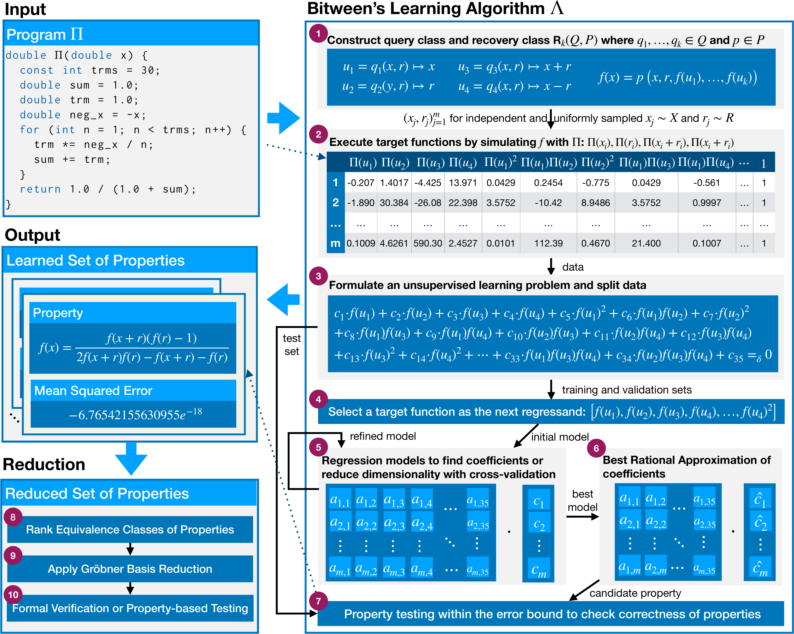

# Learning Randomized Reductions

**Authors:** Ferhat Erata, Orr Paradise, Thanos Typaldos, Timos Antonopoulos, ThanhVu Nguyen, Shafi Goldwasser, Ruzica Piskac
(Yale · EPFL · UC Berkeley · George Mason).

> _Learning Randomized Reductions._ ICML 2026 (Spotlight).
> arXiv: <https://arxiv.org/abs/2412.18134>

Randomized self-reductions (RSRs) have been a foundational tool in
cryptography and complexity theory since Goldwasser & Micali introduced
random self-reducibility in their 1984 work on probabilistic
encryption [[1]](#references), but discovering them has always required
manual expert derivation.

Concretely, an RSR is an algebraic identity over a function $f$ that lets
you (a) verify $f$'s output, (b) compute $f$ on private input without
revealing the input, or (c) self-correct an unreliable implementation of
$f$ — all by evaluating $f$ at correlated random points and checking that
the values satisfy the identity. The classical examples (Blum, Luby &
Rubinfeld [[2]](#references); Lipton [[3]](#references); matrix
multiplication, modular exponentiation) were derived by hand.

This repository contains **Bitween**, a neuro-symbolic system that learns
RSRs automatically. In its agentic variant, an LLM proposes novel query
functions guided by mathematical priors, with access to Bitween's
automated property reasoner and a formal verifier — discovering
non-linear recovery functions for **80%** of our benchmark, from sigmoid
and other ML activations to non-associative algebras and advanced
algebraic structures. The repository also ships **RSR-Bench**, an
80-function benchmark for the task.

<p align="center">
  
</p>

### V-Bitween vs. A-Bitween

Bitween ships in two variants that differ in **what query functions they
can pose**:

- **V-Bitween (Vanilla)** runs symbolic regression backends (linear
  regression, PySR, GPLearn, MILP) over the fixed query class
  $\{x{+}r,\, x{-}r,\, x \cdot r,\, x,\, r\}$. Within that class it
  recovers polynomial RSRs efficiently (sub-second on most benchmarks)
  and outperforms PySR / GPLearn / MILP on every metric. **But its
  hypothesis space is bounded by the fixed templates.**
- **A-Bitween (Agentic)** lets an LLM agent propose **novel** query
  functions ($\log k$, $\sqrt{x^2+y^2}$, function composition $f \circ
  f$, transcendental exponents, …) and discovers RSRs that lie outside
  the polynomial hypothesis space. The agent drives V-Bitween's tools
  (`inferTool` for regression, `verifyTool` for symbolic verification),
  so every property it returns is formally verified, not hallucinated.

The table below shows one example RSR per category — the left cell is
recovered by V-Bitween-LR over the fixed query set, the right cell is
what A-Bitween discovers via novel queries or non-polynomial form. All
entries are symbolically verified.

| Function | Fixed-query RSR (V-Bitween-LR) | Novel-query RSR (A-Bitween) |
|---|---|---|
| Sigmoid | $f(x) - \dfrac{f(x{+}r)\,(f(r){-}1)}{2 f(x{+}r) f(r) - f(x{+}r) - f(r)} = 0$ | $f(x{+}\log k) - \dfrac{k\, f(x)}{1 + (k{-}1) f(x)} = 0$ |
| Logarithm | $f(x \cdot y) - f(x) - f(y) = 0$ | $f(x^n) - n \cdot f(x) = 0$ |
| Modulo | *no RSR found* | $f(x{+}y) - f(f(x) + f(y)) = 0$ |
| Gudermannian | *no RSR found* | $\tan(f(x{+}r)) + \tan(f(x{-}r)) - 2 \cosh(r) \tan(f(x)) = 0$ |
| Softmax | $f(x{+}r,\, y{+}r) - f(x, y) = 0$ | $f(x,y)\, f(y,z)\, f(z,x) - f(x,z)\, f(z,y)\, f(y,x) = 0$ |
| Inverse | $f(x \cdot y) - f(x) f(y) = 0$ | $f(rx) - f(x)^2 \cdot f(r/x) = 0$ |
| $e^{x^2}$ (Gaussian) | *no RSR found* | $f(x)\, f(y) - f\!\left(\sqrt{x^2 + y^2}\right) = 0$ |
| Sinh | $f(x)^2 - f(x{+}y) f(x{-}y) - f(y)^2 = 0$ | $f(x{+}y) + f(x{-}y) - 2\sqrt{f(y)^2 + 1}\, f(x) = 0$ |
| Tanh | *no RSR found* | $f(x{+}r) - \dfrac{f(x) + f(r)}{1 + f(x) f(r)} = 0$ |
| $e^{\sin x}$ | *no RSR found* | $f(x{-}r)\, f(x{+}r) - f(x)^{2 \cos r} = 0$ |

The full table appears in the paper (Table 2); see the paper's appendix
for the complete list of RSRs Agentic Bitween discovers for every
benchmark function.

| | |
|---|---|
| Paper | _Learning Randomized Reductions_ (ICML 2026, spotlight) |
| arXiv | [2412.18134](https://arxiv.org/abs/2412.18134) |
| License | MIT |
| Python | ≥ 3.11.5, < 3.13 |

## What's in this repo

| Path | What |
|---|---|
| `src/bitween/` | Core algorithm (Algorithm 1 in the paper). |
| `src/bitween/main.py` | `infer_property(...)` — V-Bitween entry point (regression + symbolic verification). |
| `src/bitween/agent.py`, `bedrock_agent.py`, `openai_agent.py` | A-Bitween entry points (LLM agent driving `inferTool` and `verifyTool`). |
| `src/bitween/evaluation/` | RSR-Bench harnesses for both V-Bitween and A-Bitween, plus the algebraic-extension benchmarks. The 80 benchmark functions are encoded directly as Python `test_*(...)` callables in these scripts. |
| `evaluation/evaluation.slurm` | Cluster-launcher used to produce the paper's numbers. |
| `evaluation/create_table.py` | Aggregator that turns per-run logs into the paper's tables. |
| `results/` | Canonical CSVs (`Sheet1-ICML.csv`, `Sheet1-ICML-Algebraic.csv`) backing every paper table. |

## Benchmark suite

### RSR-Bench (80 scalar real-valued functions)

RSR-Bench groups 80 functions into 8 categories spanning basic arithmetic,
elementary transcendentals, machine-learning activations, and special
functions. Each function ships as a callable Python program; the canonical
inventory backing every paper table is
`results/Bitween-Results(Sheet1-ICML).csv`.

| # | Category | Functions |
|---|---|---|
| 1 | **Basic** | Identity, Squared, Cube, Fourth Power |
| 2 | **Exponential** | Exp, Exp Minus One, Exp Div By X, Exp Div By X Composite, 2 to X, 10 to X, Exp X², Exp Cosine, Exp Sin |
| 3 | **Logarithmic** | Log, Log2, Log1p, Logit, Log Cosine |
| 4 | **Trigonometric** | Sin, Cos, Tan, Cot, Sec, Csc, Sinc, Sinc Composite |
| 5 | **Hyperbolic** | Sinh, Cosh, Tanh |
| 6 | **Inverse trigonometric** | Arcsin, Arccos, Arctan, Arcsinh, Arccosh, Arctanh |
| 7 | **Machine-learning activations / losses** | Sigmoid, Softmax2 (variants), ReLU, Leaky ReLU, Swish, GELU, Logistic, Logistic Scaled |
| 8  | **Special**             | Gamma, Erf, Gudermannian, Sqrt, Cbrt, Abs, Sign, Floor, Ceil, Frac |
| 9  | **Rational**            | Inverse, Inverse Square, Inverse Add, Inverse Cot Plus One, Inverse Tan Plus One, x/(1−x), −x/(1−x), Padé(1,1), Padé(2,2), Möbius Simple, Möbius Inversion, Möbius Cayley |
| 10 | **Continued fractions** | Continued-fraction Golden, Continued-fraction Tan |
| 11 | **Multivariate**        | Floudas, Mean, Diff Squares, Int Mult |

Each entry in the canonical CSV records, per backend, the number of RSRs
discovered, the number of total verified properties, the number of
unverified candidates, the runtime (seconds), and (for neural backends) the
token count. The Python harness that runs all 80 benchmarks is
`src/bitween/evaluation/evaluation_rsr_bench_paper.py`.

#### Results at a glance (RSR-Bench, 80 functions)

Numbers below are reproduced from Table 1 of the paper. The result format is
`RSRs / verified | unverified` (RSRs are a manually-confirmed subset of the
verified properties). Coverage is the percentage of benchmarks where the
method returned at least one RSR. Time is `min | avg | max` (seconds).

**Vanilla Bitween** — symbolic regression backends within the fixed query
set $\{x{+}r,\, x{-}r,\, x \cdot r,\, x,\, r\}$:

| | PySR | GPLearn | MILP | **V-Bitween-LR** |
|---|---|---|---|---|
| Results | 61 / 61 \| 60 | 48 / 48 \| 54 | 74 / 74 \| 29 | **87 / 87 \| 46** |
| RSR coverage | 38% | 32% | 51% | **54%** |
| Time (s) | 113 \| 335 \| 956 | 0 \| 140 \| 629 | 0 \| 11 \| 47 | **0 \| 5 \| 19** |

**Neural-Research baseline** — LLM agent with only a sequential-thinking
tool, no V-Bitween tools:

| | GPT-OSS-120B | Claude-Sonnet-4 | **Claude-Opus-4.1** |
|---|---|---|---|
| Results | 170 / 360 \| 112 | 191 / 421 \| 153 | **250 / 539 \| 172** |
| RSR coverage | 62% | 60% | **64%** |
| Time (s) | 5 \| 10 \| 25 | 56 \| 110 \| 203 | 197 \| 286 \| 528 |

**Agentic Bitween** — LLM agent driving V-Bitween's `inferTool` and
`verifyTool`, free to propose novel query functions:

| | GPT-OSS-120B | Claude-Sonnet-4 | **Claude-Opus-4.1** |
|---|---|---|---|
| Results | 157 / 407 \| 48 | 293 / 729 \| 14 | **793 / 1628 \| 26** |
| RSR coverage | 59% | 66% | **80%** |
| Time (s) | 6 \| 30 \| 252 | 94 \| 160 \| 274 | 221 \| 378 \| 900 |

**Headline takeaways.**
- V-Bitween-LR (linear regression backend) **outperforms** PySR / GPLearn /
  MILP within the fixed query class on every metric, while running 1-2
  orders of magnitude faster.
- A-Bitween-Opus discovers **3.2×** more RSRs than the strongest
  pure-neural baseline (N-Research-Opus, 793 vs. 250) and reaches **80%
  function coverage** versus 54% for V-Bitween-LR. Its **unverified count
  drops to 26**, vs. 172 for the same model without V-Bitween's tools.

### Algebraic extension (17 non-scalar benchmarks)

The framework's regression and verification pipeline is agnostic to the
algebraic structure of the input domain. To probe how broadly it applies, we
constructed an additional benchmark set of 17 functions drawn from
non-scalar algebraic structures, ranging from $2{\times}2$ matrices through
non-associative algebras and Lie algebras. Inputs are encoded as scalars by
flattening; the symbolic and agentic backends operate unchanged. The
canonical inventory lives at
`results/Bitween-Results(Sheet1-ICML-Algebraic).csv`.

| ID | Function | Domain |
|---|---|---|
| A01 | $\det(A)$ (additive) | $2{\times}2$ matrices |
| A02 | $\det(A)$ (multiplicative) | $2{\times}2$ matrices |
| A03 | $\mathrm{tr}(A)$ | $2{\times}2$ matrices |
| A04 | $\lVert q\rVert^2$ (additive) | quaternions |
| A05 | $\lVert q_1 q_2\rVert^2$ | quaternions |
| A06 | $\mathrm{tr}(A^2)$ | $2{\times}2$ matrices |
| A07 | $e_2(x,y,z)$ | elementary symmetric polynomial |
| A08 | $e_3(x,y,z)$ | elementary symmetric polynomial |
| A09 | $p_2(x,y,z)$ | power-sum polynomial |
| A10 | $\lVert\mathbf{v}\rVert^2$ (2D) | vectors |
| A11 | $\lVert\mathbf{a}\times\mathbf{b}\rVert^2$ | vectors |
| A12 | $\lVert o\rVert^2$ (8D) | octonions (Moufang loop) |
| A13 | $\lVert o_1 o_2\rVert^2$ | octonions |
| A14 | $\mathrm{Cl}(3,0)$ conjugation norm | Clifford algebra |
| A15 | $\mathrm{Cl}(2,0)$ determinant (mult.) | Clifford algebra |
| A16 | $\mathrm{tr}([A,B]^2)$ | $\mathfrak{gl}(2)$ Lie bracket |
| A17 | $B(X,X)$, $\mathfrak{sl}(2)$ Killing form | Lie algebra |

Across all 17 algebraic benchmarks Agentic Bitween (Claude Opus 4.1)
discovers verified RSRs for every function (170 RSRs out of 371 verified
properties in total). Vanilla Bitween-LR, restricted to the fixed query
class $\{x{+}r, x{-}r, x \cdot r, x, r\}$ and polynomial recovery, returns
12 RSRs out of 16 verified properties across 11 of the 17 benchmarks. The
algebraic benchmarks are reported separately from RSR-Bench.

## Installation

```bash
# Clone and pin Python (any tool that respects pyproject.toml works).
git clone https://github.com/ferhaterata/learning-randomized-reductions.git
cd learning-randomized-reductions

# Option A — Poetry (recommended).
poetry install

# Option B — pip / venv.
python3.11 -m venv .venv && source .venv/bin/activate
pip install -e .
```

Copy and edit the environment template:

```bash
cp .env.example .env
# fill in AWS_PROFILE / OPENAI_API_KEY etc., as needed
```

The symbolic-only path of V-Bitween (LR / PySR / GPLearn / PuLP-MILP) runs
out of the box. **A-Bitween** needs either an AWS Bedrock profile *or* an
OpenAI-compatible endpoint configured in `.env`.

> **Optional:** install Gurobi if you want the MILP-with-Gurobi backend.
> The PuLP/CBC fallback ships and is sufficient for every result reported in
> the paper.

## Quickstart

### V-Bitween — symbolic-only, single function

```bash
poetry run python -c "
from bitween.evaluation.evaluation_rsr_bench import test_sigmoid
test_sigmoid()
"
```

This runs Algorithm 1 (sample correlated inputs → polynomial regression on
$\{f(x{+}r), f(x{-}r), f(x), f(r)\}$ → SymPy-verify each candidate) and
prints the verified RSRs to stdout.

### V-Bitween — full RSR-Bench (80 functions)

```bash
poetry run python -m bitween.evaluation.evaluation_rsr_bench_paper \
    --method multiple_regression \
    --timeout_sec 1800 \
    --res_dir results/local-vbitween-lr/
```

Available `--method` values: `multiple_regression` (paper default = LR), `pysr`,
`gplearn`, `eager_milp` (with `--milp pulp` or `--milp gurobi`), and others.
Run `--help` for the full list. The script writes one `.txt` log per benchmark
plus a summary CSV.

### A-Bitween — LLM-agent variant on RSR-Bench

```bash
# Bedrock
poetry run python -m bitween.evaluation.evaluation_rsr_bench_agentic_paper \
    --agent_type bedrock \
    --model_id us.anthropic.claude-sonnet-4-20250514-v1.0 \
    --region_name us-west-2 \
    --res_dir results/local-abitween-bedrock/

# OpenAI-compatible (vLLM, OpenAI, Together, …)
poetry run python -m bitween.evaluation.evaluation_rsr_bench_agentic_paper \
    --agent_type openai \
    --model_id openai/gpt-oss-120b \
    --base_url http://localhost:8000/v1 \
    --res_dir results/local-abitween-openai/
```

The agent receives the source of $f$ in its system prompt, can call
`inferTool` (V-Bitween's regression backend) and `verifyTool` (SymPy
verification) iteratively, and emits a list of verified RSRs.

## Reproducing paper results

The paper's three headline tables come straight from the canonical CSVs in
`results/`:

| Paper table | CSV column block | Source command |
|---|---|---|
| Table 2 (Aggregate) | aggregated from all blocks | `evaluation/create_table.py` |
| Table 3 (V-Bitween per-function) | cols 2–21 | `evaluation_rsr_bench_paper.py --backend {lr,pysr,gplearn,milp}` |
| Table 4 (A-Bitween per-function) | cols 24–57 | `evaluation_rsr_bench_agentic_paper.py --provider {bedrock,openai}` |
| Tables 8–10 (algebraic) | `…-Algebraic.csv` | `evaluation_rsr_bench_paper_algebraic{,_extended}.py` and `…_agentic_…` |

To re-run everything on a SLURM cluster:

```bash
sbatch evaluation/evaluation.slurm
```

## Repository layout

```
learning-randomized-reductions/
├── src/bitween/                 # algorithm + agent harness
│   ├── main.py                  # infer_property() — V-Bitween entry
│   ├── analyzer.py, sampler.py, … # paper §3 building blocks
│   ├── agent.py, bedrock_agent.py, openai_agent.py
│   └── evaluation/              # RSR-Bench harnesses (80 funcs + algebraic)
├── evaluation/                  # SLURM + table-aggregation scripts
├── results/                     # canonical CSVs (paper data)
├── pyproject.toml
├── .env.example
└── LICENSE
```

## Citation

If you use this work, please cite our ICML 2026 paper:

```bibtex
@inproceedings{erata2026learning,
  title         = {Learning Randomized Reductions},
  booktitle     = {Proceedings of the 43rd International Conference on Machine Learning},
  series        = {Proceedings of Machine Learning Research},
  volume        = {306},
  year          = {2026},
  publisher     = {PMLR},
  note          = {Spotlight},
  eprint        = {2412.18134},
  archivePrefix = {arXiv},
  primaryClass  = {cs.LG},
  url           = {https://arxiv.org/abs/2412.18134},
}
```

This entry will be replaced with the official PMLR proceedings entry once it lands.

## References

[1] S. Goldwasser and S. Micali. *Probabilistic Encryption*. Journal of
Computer and System Sciences, 28(2):270–299, 1984.
<https://doi.org/10.1016/0022-0000(84)90070-9>

[2] M. Blum, M. Luby, and R. Rubinfeld. *Self-Testing/Correcting with
Applications to Numerical Problems*. Journal of Computer and System
Sciences, 47(3):549–595, 1993.
<https://doi.org/10.1016/0022-0000(93)90044-W>

[3] R. J. Lipton. *New Directions in Testing*. In *Distributed Computing
and Cryptography* (DIMACS Workshop), volume 2 of DIMACS Series, pages
191–202, 1989.
<https://doi.org/10.1090/dimacs/002/13>

## License

MIT — see `LICENSE`.

## Contact

Ferhat Erata — `ferhat.erata@yale.edu` · `ferhat@ieee.org`
Yale University · Department of Computer Science
